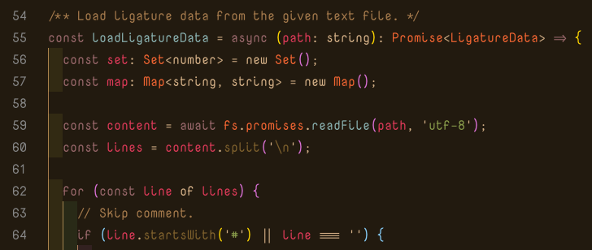

# Yuki Code

Yuki Code is monospaced font for programmers.

(Color Scheme: Kimble Dark with [indent-rainbow](https://marketplace.visualstudio.com/items?itemName=oderwat.indent-rainbow) plugin)

## About

Yuki Code is combined with three fonts:

  - [Nova Mono](https://fonts.google.com/specimen/Nova+Mono) (for ASCII characters)
  - [Source Han Code JP](https://github.com/adobe-fonts/source-han-code-jp) (for other CJK characters)
  - [Fira Code](https://github.com/tonsky/FiraCode) (for ligatures)

So, this font inherits three fonts features like that:

  - ✨ Beautiful (I know Nova Mono is the most beautiful monospaced font!)
  - 🈷️ Japanese Support (Japanese character's width is just double of ASCII's width.)
  - 🈴 Ligatures Support (e.g. `==`, `!=`, `<=>` and more)

**NOTE**: To reduce building time and file size,
          this font imports only Hiragana/Katakana/Joyo Kanji/Jinmeiyou Kanji and some full-width symbols from Source Han Code JP.
          See [full list of including characters](resources/data/cjk.txt).

## Development

1. Clone this repository: `git clone https://github.com/MakeNowJust/yuki-code`
1. Install dependencies: `yarn install`
2. Build the font: `yarn build`

## License

SIL Open Font License
(C) 2020 TSUYUSATO Kitsune

In addition, files under [`resources/fonts`](resources/fonts) are licensed in its own license.
